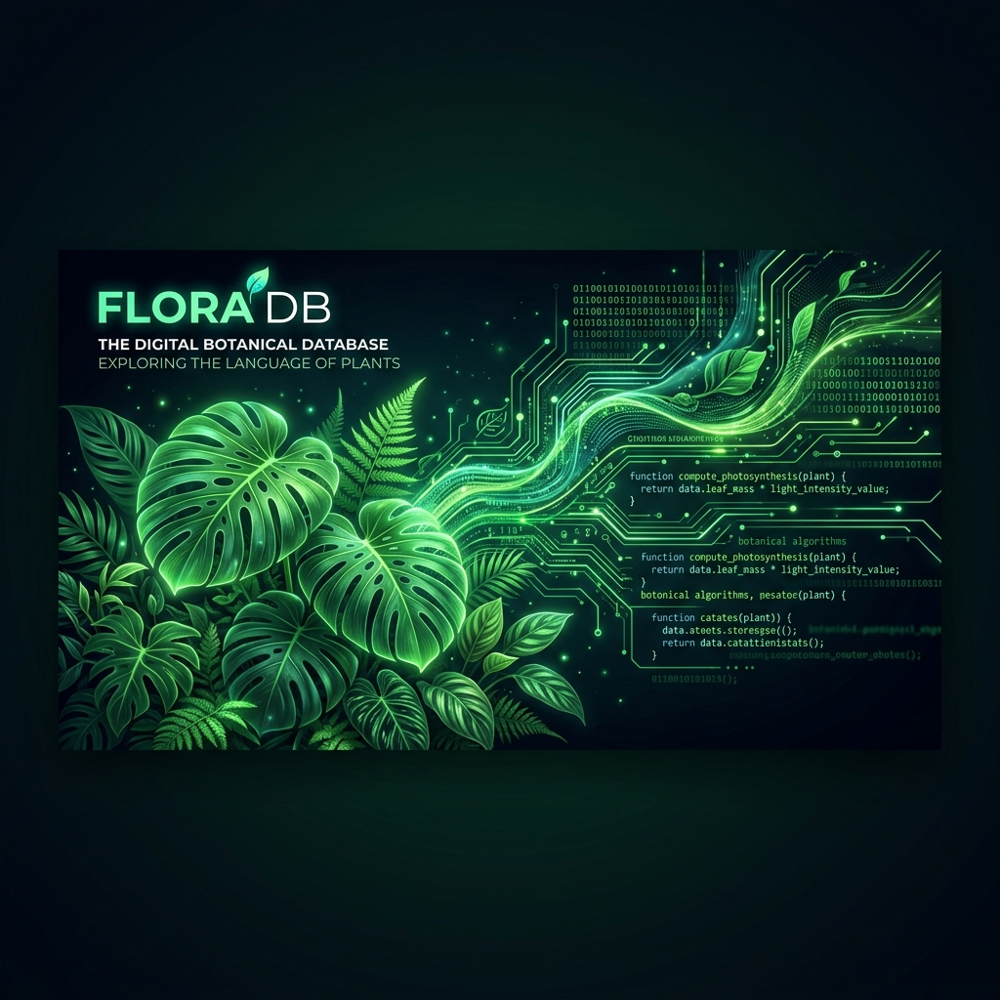

<div align="center">



# 🌿 FloraDB — Houseplant Care & Pet-Toxicity Dataset

**270 curated houseplants · quantitative light / water / temperature metrics · ASPCA dog & cat toxicity · GBIF-verified names · 20,000+ species taxonomic index**

[](samples/floradb_sample.csv)
[](https://huggingface.co/datasets/Ichlibitiche/floradb-houseplants-care-sample)
[](https://huggingface.co/spaces/Ichlibitiche/dataset-sample-explorers)
[](#whats-inside)
[](#provenance)
[](CHANGELOG.md)
[](https://houseplants-botanical-floradb.pages.dev)

**[→ Get the full dataset at floradb](https://houseplants-botanical-floradb.pages.dev)**

</div>

---

A structured dataset that turns subjective houseplant care advice — *"bright indirect light"*, *"water when dry"* — into **quantitative engineering metrics** (Lux thresholds, watering-day intervals, temperature and humidity ranges), joined to **ASPCA dog/cat toxicity** and grounded on the **GBIF Taxonomic Backbone**, with a **source URL on every record** so any fact can be re-verified.

This is a **curated care + safety** dataset — strong on quantitative care, verified taxonomy, and pet toxicity. Care metrics are **category-normalized** (a light category maps to a standard Lux range), not per-plant instrument readings, and toxicity is **ASPCA-sourced or explicitly `unknown` — never guessed safe**. The honest [field-coverage table](#field-coverage-the-honest-numbers) below shows exactly what is and isn't populated. No hype — just what's in the box.

## What's inside

| | Full dataset | Free sample |
| :--- | ---: | ---: |
| Curated care plants | **270** | 100 |
| Botanical families | **54** | 28 |
| ASPCA toxicity records | **891** | (linked) |
| Species taxonomic index (GBIF) | **20,000+** | — |
| Enriched species (names/images/range) | **702** | (joined) |
| Formats | SQLite · CSV · JSON | CSV |

The free [`samples/floradb_sample.csv`](samples/floradb_sample.csv) is 100 plants across 28 families — a real taste of the schema and quality (a deliberate mix of verified, genus-inferred, and unknown toxicity so you see the honest flags). Explore it interactively in the [🤗 Sample Explorer](https://huggingface.co/spaces/Ichlibitiche/dataset-sample-explorers), or load it straight from the [🤗 sample dataset](https://huggingface.co/datasets/Ichlibitiche/floradb-houseplants-care-sample). The full dataset is available at **[floradb](https://houseplants-botanical-floradb.pages.dev)**.

## Field coverage (the honest numbers)

Measured across all **270** care-core plants. Published up front so you can decide if the fields you need are covered — every plant has full care metrics, but toxicity and enrichment are partial.

| Field | Coverage | | Field | Coverage |
| :--- | ---: | --- | :--- | ---: |
| Scientific name (GBIF-accepted) | 100% | | Native range | 96% |
| Common name / family | 100% | | Vernacular names (multilingual) | 81% |
| Light category + Lux range | 100% | | Pet toxicity determined | 63% |
| Watering / temp / humidity | 100% | | — species-verified (ASPCA) | 125 |
| Representative image ref | 99% | | — genus-inferred (conservative) | 45 |

**Two quality tiers** (both in the full dataset):
- **Full care core** — all **270** plants with quantitative care metrics.
- **Verified tier** — **125** plants with species-level **ASPCA** toxicity determinations and GBIF-verified names.

### Data-quality flags — the honest part
Every row is self-describing so you can filter on confidence:
- `care_confidence` — `high` (69 hand-authored) · `medium` (137 family-normalized) · `low` (64 generic default).
- `toxicity_status` — `aspca_verified` (125) · `aspca_genus_inferred` (45, conservative, never "safe") · `unknown` (100).
- `image_commercial_safe` — only **28** image references are CC-BY/CC0; the rest are non-commercial. Filter before commercial use.

## Provenance

Every record is traceable and re-verifiable:

| Field | Meaning |
| :--- | :--- |
| `scientific_name` | GBIF-accepted canonical name |
| `gbif_usage_key` | GBIF backbone key |
| `gbif_source_url` | Exact GBIF species page the taxonomy was verified against |
| `toxicity_status` | Where the toxicity determination came from (ASPCA / genus / unknown) |
| `dataset_version` | Snapshot id (`2026.07`) |

See [`DATA_DICTIONARY.md`](DATA_DICTIONARY.md) for every field.

## Pricing

| Tier | What | Price |
| :--- | :--- | :--- |
| **Sample** | 100 plants (this repo) | Free |
| **Snapshot** | Full 270 care core + 891 toxicity + 20,000+ index · SQLite + CSV + JSON | **$49** one-time |
| **Custom & Enterprise** | Your target plant list · recurring refreshes · API | **$99+** |
| **Live lookup** | On-demand, self-serve via Apify | pay-per-result |

**[→ Get it at floradb](https://houseplants-botanical-floradb.pages.dev)** · or email **[floradb.hardhat456@simplelogin.com](mailto:floradb.hardhat456@simplelogin.com)** for custom work.

> 🔄 **Prefer live, self-serve lookups?** Run the [Houseplant Care & Pet-Toxicity Lookup on Apify](https://apify.com/dataengineered/houseplant-care-toxicity-lookup) — pay-per-result, GBIF-verified taxonomy + ASPCA toxicity on demand.

## Use cases

- Plant-ID and plant-care apps (structured care + pet-safety data)
- IoT smart planters (Lux targets and watering intervals as machine values)
- "Is this plant safe for my cat?" features backed by ASPCA determinations
- ML / RAG corpora over houseplant care and botany

## Quick look

```python
import csv
rows = list(csv.DictReader(open("samples/floradb_sample.csv", encoding="utf-8")))
print(len(rows), "plants from", len({r["family"] for r in rows}), "families")
# → 100 plants from 28 families
```

A fuller example is in [`examples/load_sample.py`](examples/load_sample.py).

## License

- **Sample data & docs in this repo:** CC-BY-NC-4.0 — free to use with attribution, non-commercial (see [`LICENSE`](LICENSE)).
- **Full dataset:** commercial license, available at [floradb](https://houseplants-botanical-floradb.pages.dev). Distributed as derived factual attributes with source attribution.
- **Safety note:** toxicity data is provided for informational use and is not veterinary advice. If a pet ingests a plant, contact a vet or the ASPCA Animal Poison Control Center.

Want a plant record corrected? Email **[floradb.hardhat456@simplelogin.com](mailto:floradb.hardhat456@simplelogin.com)**.
